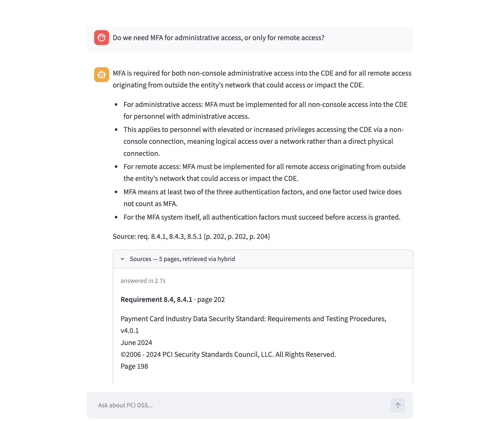
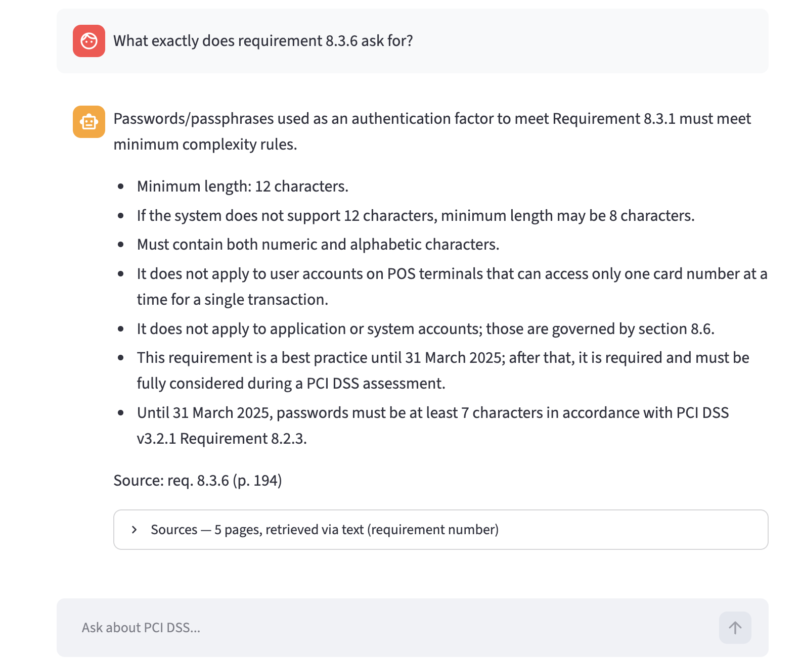

# PCI DSS Assistant

A question-answering assistant over the **PCI DSS v4.0.1** standard — the security
standard every company that stores, processes, or transmits payment card data has
to comply with.

> Status: work in progress. This README is updated as each step is completed.

## Problem

PCI DSS v4.0.1 is a 397-page document containing 300+ individual requirements.
Engineers, auditors, and compliance officers constantly need answers to concrete
questions:

- *How long do we have to retain audit logs?*
- *Do we need MFA for administrative access, or only for remote access?*
- *Can we store the CVV after the transaction is authorized?*
- *What exactly does requirement 8.3.6 ask for?*

Finding the answer means opening a PDF, guessing the right keyword, and reading
around a table that spans three columns. The answer is almost always there — the
problem is retrieval, not the absence of information. That is exactly the shape of
problem RAG solves.

This project ingests the standard, retrieves the relevant pages for a question, and
has an LLM answer using only those pages, always citing the requirement number and
page so the answer can be verified against the source.

## Data

- **Source:** PCI DSS v4.0.1 (June 2024), published by the PCI Security Standards Council.
- **Size:** 397 pages, of which 261 belong to the "Requirements and Testing Procedures" section.
- **Chunking:** one document per page. The standard is laid out so that a page
  almost always holds a single requirement together with its testing procedures and
  guidance (1.4 requirements per page on average), which makes the page a natural
  unit of meaning. Documents are 800–3600 characters, ~2100 on average.

The PDF is **not** committed to this repository. The PCI SSC publishes it for free
but restricts redistribution, so `ingest.download_pdf()` fetches it at setup time.

## Plan

The project is built step by step. Steps 1–7 mirror the structure of the
LLM Zoomcamp modules; steps 8–11 cover what the course did not.

| # | Step | What it delivers | Criterion |
|---|------|------------------|-----------|
| 1 | Data | PDF parsed into a list of documents | — |
| 2 | Text search | minsearch index, retrieve pages for a question | Retrieval flow |
| 3 | First RAG | context → prompt → OpenAI → answer with citations | Retrieval flow |
| 4 | Ground truth | LLM-generated questions for each page | — |
| 5 | Search evaluation | hit rate and MRR for text search | Retrieval evaluation |
| 6 | Vector & hybrid search | local embeddings, RRF fusion, routing by question type | Retrieval evaluation, hybrid search |
| 7 | Answer evaluation | several prompts compared with LLM-as-a-judge | LLM evaluation |
| 8 | Interface | Streamlit chat UI | Interface |
| 9 | Feedback & monitoring | Postgres + Grafana dashboard | Monitoring |
| 10 | Ingestion pipeline | automated ingestion | Ingestion pipeline |
| 11 | Docker & docs | one-command startup, full README | Containerization, reproducibility |

### Progress

- [x] 1 — Data
- [x] 2 — Text search
- [x] 3 — First RAG
- [x] 4 — Ground truth
- [x] 5 — Search evaluation
- [x] 6 — Vector & hybrid search
- [x] 7 — Answer evaluation
- [x] 8 — Interface
- [ ] 9 — Feedback & monitoring
- [ ] 10 — Ingestion pipeline
- [ ] 11 — Docker & docs

## Retrieval evaluation

Ground truth: 1305 questions generated by an LLM, five per page, each answerable from
that page alone. The prompt asks for the questions to avoid reusing the page's
wording, otherwise TF-IDF would find them trivially and the metrics would be
meaningless.

**Hit rate** is the share of questions whose correct page appears in the top 5.
**MRR** additionally rewards the page for being near the top (rank 1 → 1.0, rank 2 → 0.5).

### Text search (minsearch, TF-IDF)

| Configuration | Hit rate | MRR |
|---|---|---|
| no boost | 0.958 | 0.890 |
| `req_ids` × 0.5 | 0.958 | 0.890 |
| `req_ids` × 3 | 0.958 | 0.890 |
| `req_ids` × 10 | 0.958 | 0.890 |
| text only (`req_ids` × 0) | 0.863 | 0.718 |

Boosting the requirement-number field turned out to be irrelevant, while *having*
the field is decisive. A requirement number matches exactly one page, so any positive
weight already ranks it first — which is why the boost was removed from the code
rather than tuned.

### Split by question type

Some generated questions quote a requirement number ("what does 8.3.6 require?"),
and those are found trivially. Measured separately:

| Question type | Configuration | Hit rate | MRR |
|---|---|---|---|
| mentions a requirement number | no boost | 0.977 | 0.958 |
| mentions a requirement number | text only | 0.822 | 0.675 |
| plain language | no boost | 0.928 | 0.788 |
| plain language | text only | 0.925 | 0.783 |

Two things become visible only after splitting. Dropping `req_ids` costs almost
nothing on plain-language questions (0.788 → 0.783) and is catastrophic on numbered
ones (0.958 → 0.675) — the field exists entirely to serve one kind of question. And
the plain-language figure, **hit rate 0.928 / MRR 0.788**, is the honest headline for
text search: it is what a user who does not already know the requirement number
experiences. The aggregate 0.958 is flattered by the easy half of the set.

### Vector and hybrid search

Embeddings are computed locally with `sentence-transformers`, so retrieval costs
nothing and needs no API key. Two models were compared: `all-MiniLM-L6-v2`
(general purpose, 256-token window) and `multi-qa-MiniLM-L6-cos-v1` (trained for
question-to-passage retrieval, 512-token window).

The window matters here. Pages are 394 tokens on average and 687 at most, so a
256-token model silently discards the tail of three quarters of them — and the tail
is where the testing procedures and guidance live.

Hybrid search merges the text and vector result lists with **Reciprocal Rank Fusion**.
Their scores are on incomparable scales, so RRF combines positions instead:
`score(doc) = Σ 1 / (60 + rank)`.

| Approach | MRR | Hit rate | MRR, plain questions | MRR, numbered questions |
|---|---|---|---|---|
| **routed (text \| hybrid)** | **0.897** | **0.969** | **0.804** | **0.958** |
| text (TF-IDF) | 0.890 | 0.958 | 0.788 | 0.958 |
| hybrid (RRF) | 0.748 | 0.951 | 0.803 | 0.712 |
| vector (multi-qa) | 0.522 | 0.679 | 0.702 | 0.404 |
| vector (MiniLM) | 0.508 | 0.671 | 0.694 | 0.386 |

### Why the application routes instead of picking one retriever

The two right-hand columns tell the real story: **the best retriever depends on the
question.**

- A question quoting a requirement number is an exact-match problem. TF-IDF nails it
  (MRR 0.958); embeddings are nearly useless, because `8.3.6` carries no meaning in
  vector space (MRR 0.404). Fusion actively *hurts* here — mixing in the vector
  ranking drags the one exactly matching page down, costing a quarter of the MRR
  (0.958 → 0.712).
- A plain-language question is a semantic problem, and there hybrid beats text search
  (0.803 against 0.788).

So the application detects a requirement number in the question and skips fusion when
it finds one. That takes the better number from each column and beats every single
retriever overall. The detection is a regular expression tight enough not to fire on
"PCI DSS 4.0.1" or "3.50 dollars"; it is verified against all 351 requirement numbers
in the standard.

### Number of retrieved pages

| `num_results` | Hit rate | MRR |
|---|---|---|
| 3 | 0.940 | 0.891 |
| 5 | 0.962 | 0.895 |
| 10 | 0.984 | 0.898 |

Hit rate rises mechanically with more results, so it cannot justify the choice on its
own. MRR is flat, meaning the extra pages only pile up at the bottom of the list while
costing tokens and diluting the context. The application retrieves 5.

### Fusion candidates

How many candidates each retriever hands to the fusion step, measured on
plain-language questions:

| `candidates` | Hit rate | MRR |
|---|---|---|
| 5 | 0.961 | 0.807 |
| 10 | 0.957 | 0.803 |
| 20 | 0.952 | 0.801 |
| 30 | 0.957 | 0.803 |

A spread of 0.006 MRR with no monotone trend — this is noise, not a tunable
parameter. The mild drift downwards is consistent with the vector retriever being the
weaker of the two: the more candidates it contributes, the more noise enters the
merge. The application uses 5, the cheapest of the tied options.

## Answer evaluation

Retrieval evaluation asks whether the right page reaches the model. This asks what the
model does with it. Three prompts were compared on the same 100 questions, with
retrieval held fixed at the routed hybrid, so any difference comes from the prompt
alone:

- **minimal** — "answer the question using the provided context", nothing more.
- **strict** — answer only from the context, refuse when unsure, cite a requirement
  number after every claim.
- **structured** — the same constraints, but the citations go on one `Source:` line at
  the end, and the answer follows a fixed shape.

Three things are measured, because "a good answer" in compliance is not one property:

| Prompt | Good | Citation correct | Citation wrong | No citation | Refused |
|---|---|---|---|---|---|
| minimal | 0.78 | 0.76 | 0.03 | 0.21 | 0.00 |
| **structured** | 0.74 | **0.97** | 0.02 | 0.01 | 0.01 |
| strict | 0.66 | 0.96 | 0.02 | 0.02 | 0.02 |

**Good** is the verdict of a judge model that sees the question, the answer, and the
source page, and decides whether the answer follows from that page.
**Citation correctness** uses no LLM at all: requirement numbers are pulled out of the
answer with a regex and checked against the numbers on the correct page. **Refused**
counts answers of "I don't know" to questions that are answerable by construction.

### Reading the table honestly

At n = 100 the standard error of a proportion is ~4 points, so 0.78 against 0.74 means
nothing on its own. All three prompts answered the *same* questions, though, which
allows a paired comparison — count only the questions where two prompts disagreed:

| Comparison | Wins : losses | p (two-sided binomial) |
|---|---|---|
| minimal vs structured | 11 : 7 | 0.48 — indistinguishable |
| structured vs strict | 13 : 5 | 0.10 — suggestive |
| minimal vs strict | 13 : 1 | **0.002** — real |

So the answer-quality gap between `minimal` and `structured` was noise, while `strict`
really is worse.

### Why `structured` is used

With answer quality tied, the decision falls to the second column: **0.97 against 0.76
on citations.** `minimal` leaves one answer in five with no source at all — for a
compliance question, an answer nobody can verify against the standard is worth little,
even when it happens to be right.

`strict` is the more interesting failure. It asked for a citation after every
individual claim and scored *worse on substance* than the prompt with no instructions
at all. Reading its answers shows why: the demand for inline citations everywhere
fragments the answer into cautious pieces, and the model says less. Moving the
citations to a single line at the end keeps them verifiable without distorting the
answer — a reminder that prompt instructions interact, and that an instruction about
form can quietly damage content.

A single metric would have selected `minimal`. Three metrics plus a paired test
selected `structured`.

## The application

```bash
uv run streamlit run app.py
```

A chat interface over the same `RAGHybrid` the notebook evaluated — the same
retrieval, the same prompt, no separate code path that could drift from what was
measured.



The answer follows the structure the prompt asks for: one sentence of plain language,
the specifics as bullets, and a `Source:` line with the requirement numbers.



Note the difference in the Sources header between the two: the first question was
answered *via hybrid*, the second *via text (requirement number)* — the router in
action.

Every answer comes with a collapsible **Sources** panel listing the pages that were
retrieved, the requirement numbers on them, and which branch of the router handled the
question. That last detail matters when debugging: an answer that looks wrong is
usually a retrieval problem, and knowing whether text search or fusion produced the
context points straight at the cause.

The indexes are built once per server process behind `@st.cache_resource`. Streamlit
re-runs the whole script on every interaction, so without the cache all 261 pages
would be re-embedded on every question.

### Two page numbers

The PDF has four pages of front matter, so its page index runs four ahead of the
number printed in the document: PDF page 202 is "Page 198" of the standard. Citing the
PDF index would send a reader to the wrong place, so `load_documents` parses the
printed number out of each page footer, and that is the number quoted in answers. The
Sources panel shows both.

Screenshot `app1.png` above predates this fix and still cites the PDF index.

## Technologies

| Area | Choice | Why |
|------|--------|-----|
| PDF parsing | PyMuPDF | reads page text directly, no OCR needed |
| Text search | minsearch | in-memory TF-IDF, no infrastructure; serves as the retrieval baseline |
| Vector search | sentence-transformers + `minsearch.VectorSearch` | embeddings run locally, so retrieval costs nothing and needs no API key |
| Fusion | Reciprocal Rank Fusion, ~12 lines in `rag_helper.py` | text and vector scores are on incomparable scales, so positions are merged instead |
| LLM | OpenAI | — |
| Interface | Streamlit | chat UI over the same code path the notebook evaluated |
| Monitoring | Postgres + Grafana *(step 9)* | — |

## Running it from scratch

Requires [uv](https://docs.astral.sh/uv/) and an OpenAI API key. Everything else —
Python itself, the dependencies, the source PDF — is fetched automatically.

```bash
git clone <this-repo>
cd llm-zoomcamp-project

cp .env.example .env      # then put your OPENAI_API_KEY in it
uv sync                   # installs Python 3.12 and every dependency from uv.lock

uv run jupyter notebook rag.ipynb
```

Then run the notebook cells top to bottom.

### What each step costs

| Step | Needs the API? | Time | Cost |
|---|---|---|---|
| 1 — Data | no | ~15 s (plus a 4.4 MB download) | free |
| 2 — Text search | no | instant | free |
| 3 — First RAG | yes, a few calls | seconds | fractions of a cent |
| 4 — Ground truth | yes, 261 calls | 2–4 min | ~$0.40 |
| 5 — Search evaluation | no | ~1 min | free |
| 6 — Vector & hybrid search | no | a few min (downloads two ~100 MB models) | free |
| 7 — Answer evaluation | yes, ~600 calls | 5–10 min | ~$2 |

### Skip step 4 unless you mean it

`data/ground_truth.csv` is committed, and step 5 reads it from disk. Re-running the
generation cell costs money **and** produces different questions, which makes the
metrics incomparable with the ones recorded in this README. Skip the cell with
`ThreadPoolExecutor` in it.

For the same reason, avoid "Run All" in Jupyter. After a kernel restart, the
"Resuming after a restart" cell near the top of the notebook rebuilds every in-memory
object — documents, index, client, ground truth — in a couple of seconds and without
touching the API.

## Repository layout

```
ingest.py      loading the PDF and building the search index
rag.ipynb      the working notebook — one section per step
data/          the downloaded PDF (gitignored)
```

## License and attribution

PCI DSS v4.0.1 is © 2006–2024 PCI Security Standards Council, LLC. This project
does not redistribute the standard; it downloads it and indexes it locally for
question answering. It is an educational project and is not affiliated with, nor
endorsed by, the PCI Security Standards Council.
